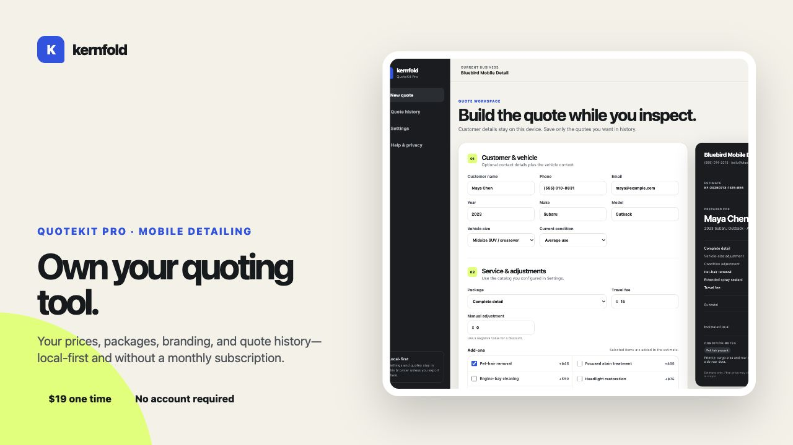

# Kernfold QuoteKit Free — Mobile Detailing Quote Builder

Build a clear mobile-detailing estimate in under a minute. QuoteKit Free runs entirely in your browser, requires no account, and sends no quote or customer details to Kernfold.

[**Open the free quote builder →**](https://kernfoldstudio.github.io/quotekit-free/)

- [Printable mobile detailing quote template](https://kernfoldstudio.github.io/quotekit-free/quote-template.html)
- [Editable mobile detailing price-list template](https://kernfoldstudio.github.io/quotekit-free/mobile-detailing-price-list.html)

## What it does

- Calculates a detailing estimate from vehicle size, condition, service package, add-ons, and travel fee.
- Produces a customer-ready summary you can copy, print, or save as a PDF.
- Works without signup, cloud storage, tracking, or a subscription.
- Uses transparent starter prices that you can review before quoting.

## Privacy

The free tool runs locally in the current browser page. Kernfold does not receive or store names, vehicle details, quote selections, or generated estimates. See the [plain-language privacy page](https://kernfoldstudio.github.io/quotekit-free/privacy.html).

## Need reusable pricing and quote history?

[QuoteKit Pro](https://kernfold.gumroad.com/l/quotekit-pro-mobile-detailing) adds custom services and prices, business branding, tax and adjustments, local quote history, backup/restore, and branded print/PDF output. It is a one-time $19 purchase with no monthly subscription.

Starter prices are examples, not market recommendations. Inspect each vehicle and use rates appropriate for your location, costs, scope, taxes, and requirements.

## Local development

Open this folder through a small static web server because the JavaScript uses ES modules. For example: `python3 -m http.server`.

Run the calculation tests with `node --test calculator.test.js`.

## License and support

The free edition is available under the MIT License. See `LICENSE.txt`. QuoteKit Pro is a separate paid product and is not included in this repository. For support, email kernfoldstudio@gmail.com.
